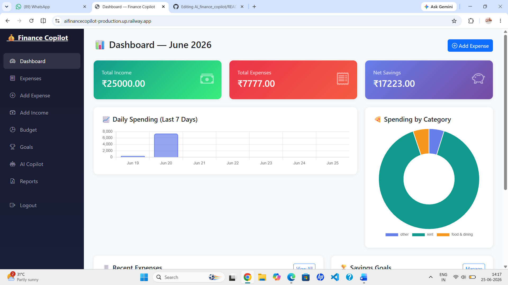
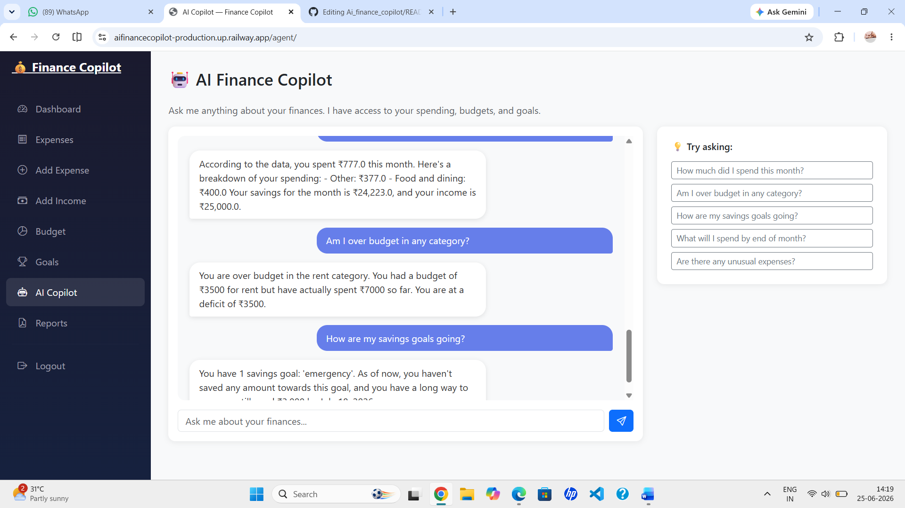
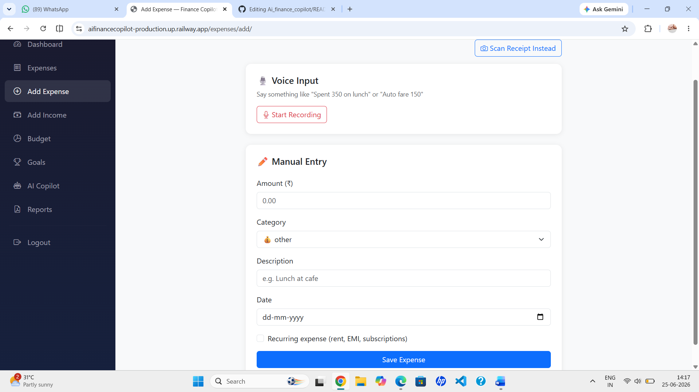
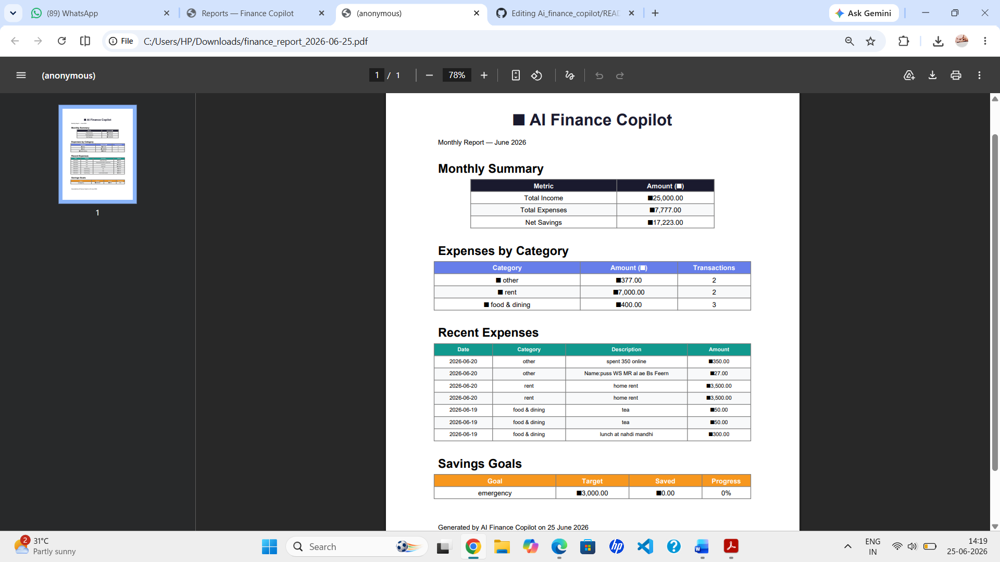

# 💰 AI Personal Finance Copilot

An AI-powered personal finance assistant built with Django and PostgreSQL, featuring agentic AI reasoning, RAG-based financial advice, receipt OCR, voice expense logging, spending forecasting, anomaly detection, and automated PDF reports.

---

## 🌐 Live Demo

**Live Application:**
https://aifinancecopilot-production.up.railway.app

**Source Code:**
https://github.com/salmasalu/Ai_finance_copilot

---

## 📌 Overview

AI Personal Finance Copilot helps users manage their finances through intelligent automation and AI-powered insights.

Unlike traditional expense trackers, the application analyzes spending patterns, forecasts future expenses, detects unusual transactions, and provides personalized financial guidance through a conversational AI assistant.

The project combines Large Language Models (LLMs), Retrieval-Augmented Generation (RAG), OCR, Machine Learning, and financial analytics into a single platform.

---

## 🚀 Features

### 🤖 Agentic AI Financial Assistant

* Groq LLaMA 3.1 powered assistant
* Multi-step financial reasoning
* Natural language financial conversations
* Context-aware spending analysis

### 📚 RAG Financial Advisor

* ChromaDB vector database
* Semantic retrieval of financial knowledge
* Personalized recommendations
* Contextual financial advice

### 🧾 Receipt OCR

* Upload receipt images
* Automatic text extraction using Tesseract OCR
* Expense amount detection
* Category suggestions

### 🎙️ Voice Expense Logging

* Voice-based expense entry
* Natural language expense extraction
* Hands-free transaction recording

### 📈 Spending Forecasting

* Monthly spending projections
* Daily trend analysis
* Budget forecasting

### 🚨 Anomaly Detection

* Isolation Forest machine learning model
* Detection of unusual spending behavior
* Outlier transaction identification

### 💵 Expense & Income Management

* Expense tracking
* Income management
* Transaction history
* Category-wise organization

### 🎯 Savings Goals

* Create financial goals
* Track progress
* Target amount monitoring

### 📊 Interactive Dashboard

* Financial summary metrics
* Spending analytics
* Category breakdown charts
* Trend visualizations

### 📄 Automated Reports

* Monthly PDF report generation
* Downloadable financial reports

### 🔐 Authentication & Security

* User registration
* Secure login
* Session-based authentication
* Protected views

---

## 🛠 Agent Tools

| Tool                  | Description                                               |
| --------------------- | --------------------------------------------------------- |
| get_spending_summary  | Monthly income, expenses, savings, and category breakdown |
| get_budget_status     | Budget utilization and remaining budget                   |
| get_savings_goals     | Savings goal progress tracking                            |
| get_spending_forecast | Future spending estimation                                |
| detect_anomalies      | Machine learning-based unusual spending detection         |
| get_financial_advice  | Personalized advice from the RAG knowledge base           |

---

## 📸 Screenshots

### Dashboard



### AI Copilot



### Expense Tracking



### Financial Reports



---

## 🏗️ System Architecture

```text
User
 │
 ▼
Django Web Application
 │
 ├── Expense Management
 ├── Income Tracking
 ├── Budget Tracking
 ├── Goal Management
 │
 ▼
AI Agent Layer
 │
 ├── Financial Tools
 ├── Spending Forecasting
 ├── Anomaly Detection
 └── RAG Retrieval
 │
 ▼
Groq LLM
 │
 ▼
Personalized Financial Insights

Database Layer
 └── PostgreSQL
```

---

## 💻 Tech Stack

| Layer            | Technology            |
| ---------------- | --------------------- |
| Backend          | Django 5              |
| Database         | PostgreSQL            |
| AI Model         | Groq LLaMA 3.1        |
| RAG              | ChromaDB              |
| Embeddings       | Sentence Transformers |
| OCR              | Tesseract OCR         |
| Machine Learning | Scikit-learn          |
| NLP              | Groq LLM              |
| Frontend         | Django Templates      |
| Styling          | Bootstrap 5           |
| Charts           | Chart.js              |
| Voice Input      | Web Speech API        |
| PDF Generation   | ReportLab             |
| Deployment       | Railway               |
| Version Control  | Git & GitHub          |

---

## 📂 Project Structure

```text
ai-finance-copilot/
│
├── finance/
│   ├── models.py
│   ├── views.py
│   ├── agent.py
│   ├── rag_utils.py
│   ├── nlp_utils.py
│   ├── ocr_utils.py
│   ├── report_utils.py
│   ├── urls.py
│   ├── admin.py
│   └── templates/
│
├── financecopilot/
│   ├── settings.py
│   └── urls.py
│
├── datasets/
│   └── financial_tips.txt
│
├── screenshots/
│   ├── dashboard.png
│   ├── copilot.png
│   ├── expense.png
│   └── report.png
│
├── Dockerfile
├── docker-compose.yml
├── requirements.txt
├── manage.py
└── README.md
```

---

## 🗄️ Database Models

### UserProfile

* Monthly income
* Budget settings
* User preferences

### Category

* Expense categories
* Category icons

### Expense

* Amount
* Category
* Date
* Input type (Manual, Voice, OCR)
* Recurring status

### Income

* Income source
* Amount
* Date

### Budget

* Category-wise budget allocation
* Monthly limits

### SavingsGoal

* Goal targets
* Progress tracking
* Deadlines

### ChatHistory

* User conversations
* AI responses

---

## ⚙️ Installation

### Clone Repository

```bash
git clone https://github.com/salmasalu/Ai_finance_copilot.git
cd Ai_finance_copilot
```

### Create Virtual Environment

**Windows**

```bash
python -m venv venv
venv\Scripts\activate
```

**Linux / macOS**

```bash
python -m venv venv
source venv/bin/activate
```

### Install Dependencies

```bash
pip install -r requirements.txt
```

### Install Tesseract OCR

Download and install Tesseract OCR and verify:

```bash
tesseract --version
```

### Configure Environment Variables

Create a `.env` file:

```env
DATABASE_URL=your_postgresql_connection_string
GROQ_API_KEY=your_groq_api_key
DJANGO_SECRET_KEY=your_secret_key
DJANGO_DEBUG=True
```

### Run Migrations

```bash
python manage.py migrate
```

### Create Admin User

```bash
python manage.py createsuperuser
```

### Run Development Server

```bash
python manage.py runserver
```

Open:

```text
http://127.0.0.1:8000
```

---

## 🎯 Key AI Concepts Demonstrated

* Agentic AI Workflows
* Retrieval-Augmented Generation (RAG)
* Vector Databases
* Large Language Models (LLMs)
* Tool Calling
* OCR-based Information Extraction
* Natural Language Processing
* Anomaly Detection
* Financial Forecasting
* Conversational AI

---

## 📈 Future Enhancements

* Email-based password reset
* Multi-currency support
* Investment portfolio tracking
* Financial risk scoring
* Mobile application
* Real-time bank integration
* Personalized financial coaching

---

## 👩‍💻 Author

**Ummusalma P T**

* GitHub: https://github.com/salmasalu
* LinkedIn: https://www.linkedin.com/in/ummusalma-p-t
* Email: [salmasalu667@gmail.com](mailto:salmasalu667@gmail.com)

---

⭐ If you found this project interesting, consider giving it a star.
